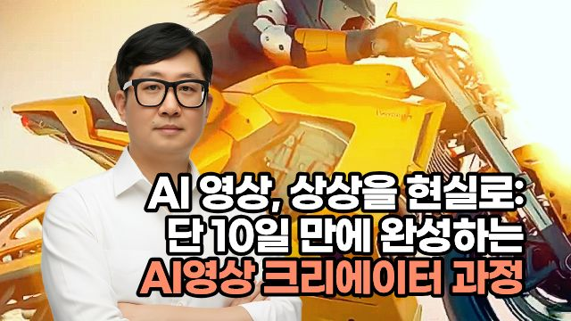
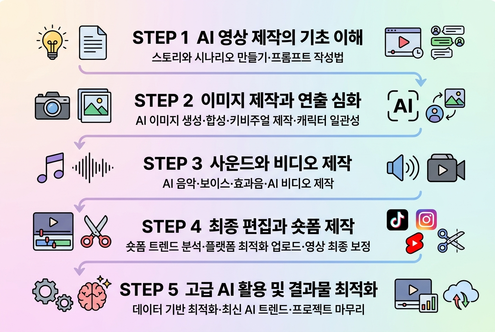
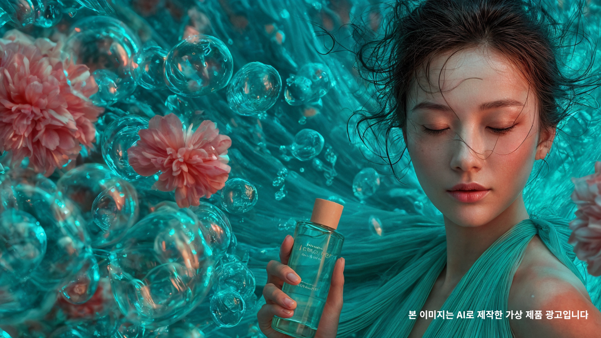
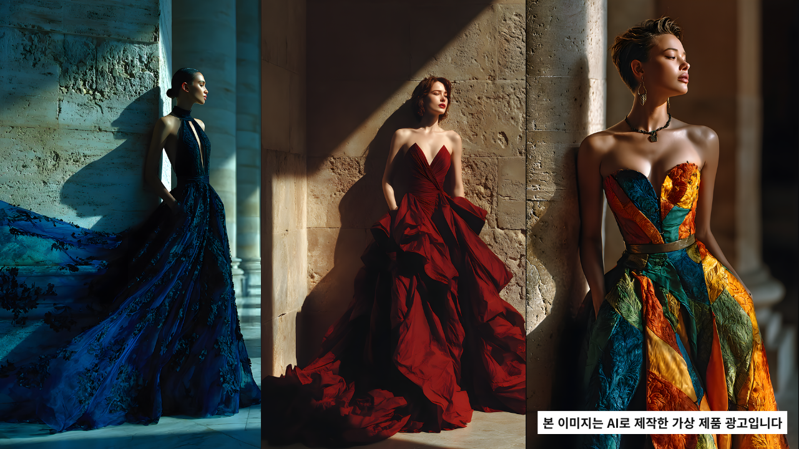
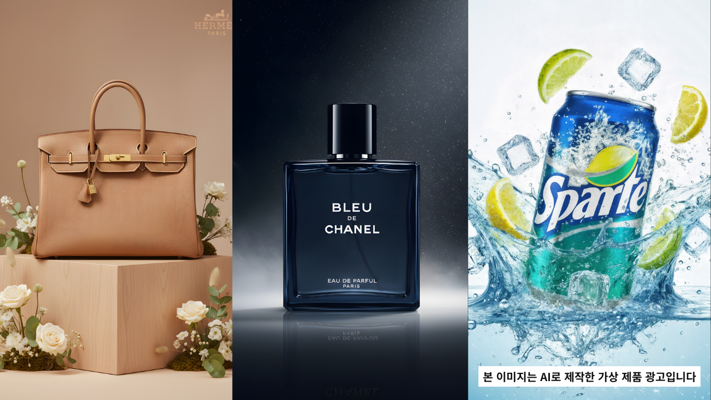

# 🤖 AI 영상, 상상을 현실로: 단 10일 만에 완성하는 AI영상 크리에이터 과정

# 상상을 현실로 만드는 AI영상

> **AI 툴을 써보는 데서 끝나는 것이 아니라, 실제 결과물로 완성하는 경험까지.**
> 
> 
> **스토리 기획부터 이미지·음악·영상 제작, 최종 편집까지 10일 안에 직접 만들어보세요.**
> 

---

## 🚀 이런 분께 특히 추천합니다

- AI를 활용한 영상 제작 역량을 익히고 싶은 분
- 숏폼·커머셜 영상 제작을 직접 경험해보고 싶은 분
- 개인 브랜드나 프로젝트에 활용 가능한 AI 영상 포트폴리오를 만들고 싶은 분
- 완성된 결과물을 온라인 채널에 직접 게시해보고 싶은 분
- AI콘텐츠 공모전까지 도전해보고 싶은 분

> **“툴은 써봤지만, 완성도 있는 영상 결과물로 연결해본 적은 없다”는 분께 특히 잘 맞는 과정입니다.**
> 

---

## 📌 1. 과정 한눈에 보기

> **생성형 AI 도구를 연결해, 실제 영상 결과물까지 완성하는 실습형 과정입니다.**
> 
- **난이도** : 생성형 AI 툴에 관심이 있다면 누구나 가능
🚫 본 과정은 입문으로 시작해 중급 수준까지 도달하는 수업으로 **점차적으로 난이도가 높아집니다.**
- **교육시간** : 총 30시간 / 10회차 / 회차당 3시간
- **주요 도구** : ChatGPT, Gemini, Flow, Dreamina AI, SunoAI, MiniMax Audio, SupertonePlay, Eleven Labs, KlingAI, CapCut
- **교육 방식** : 실습 중심 / 결과물 중심 / 포트폴리오형 교육

### 한 줄 요약

스토리 기획부터 이미지·음악·영상 제작, 최종 편집까지 생성형 AI 도구를 활용해 **나만의 숏폼·커머셜 영상과 포트폴리오**를 완성하는 과정입니다.

### 추천 대상

- AI 영상 제작 역량을 익히고 싶은 분
- 결과물 중심으로 배우고 싶은 분
- 포트폴리오까지 남기는 실전형 수업을 찾는 분

---

## 💡 2. 왜 이 과정을 들어야 할까요?

이제 영상 제작은 더 이상 일부 전문가만의 영역이 아닙니다. 스토리 기획, 이미지 제작, 음악 생성, 영상 편집까지 AI 도구의 발전으로 누구나 훨씬 빠르고 효율적으로 결과물을 만들 수 있는 환경이 열리고 있습니다. 하지만 도구를 개별적으로 체험해보는 것과, 실제 하나의 완성도 있는 영상 결과물로 연결하는 것은 전혀 다른 문제입니다.

이 과정은 ChatGPT, ImageFX, Suno, Kling, CapCut 등 다양한 생성형 AI 도구를 활용해 **기획부터 제작, 편집, 최종 결과물 완성까지의 전체 흐름**을 직접 경험하도록 설계된 실습 중심 프로그램입니다. 단순히 툴 사용법만 익히는 것이 아니라, 각 도구를 어떻게 연결해 하나의 콘텐츠로 완성할지까지 단계적으로 익히게 됩니다.

수강생은 과정을 통해 나만의 숏폼·커머셜 영상을 직접 제작하고, 완성된 결과물을 개인 포트폴리오와 온라인 채널에 게시할 수 있는 수준까지 도달하게 됩니다. 실생활·업무·창작 활동은 물론, 향후 공모전 도전까지 이어갈 수 있는 실전형 역량을 쌓을 수 있습니다.

> **AI 툴을 하나씩 체험하는 수준을 넘어, 하나의 완성도 있는 콘텐츠로 연결하는 힘을 만드는 과정입니다.**
> 

---

## 🔄 3. 수강 전 / 후 변화

### 😵 BEFORE

- AI 영상 제작 전 과정을 체계적으로 경험해보지 못한 상태
- 생성형 AI 도구를 개별적으로만 접해본 상태
- 숏폼·커머셜 영상 결과물 제작 경험이 부족한 상태
- 결과물을 실생활·업무·창작 활동에 연결하기 어려운 상태

### ✨ AFTER

- 스토리 기획부터 이미지·음악·영상 제작, 최종 편집까지 전 과정을 단계별로 체험
- ChatGPT, ImageFX, Suno, Kling, CapCut 등 최신 AI 도구를 직접 활용
- 나만의 숏폼·커머셜 영상을 완성하고 포트폴리오로 정리
- 완성된 결과물을 개인 포트폴리오와 온라인 채널에 게시하여 활용

> **“도구를 써봤다”에서 끝나는 것이 아니라, “내 결과물을 완성했다”로 바뀌게 됩니다.**
> 

---

## 🎯 4. 학습 목표

- 스토리 기획부터 이미지·음악·영상 제작, 최종 편집까지 **AI 영상 제작 전 과정을 단계별로 체험**할 수 있습니다
- ChatGPT, Flow, Suno, Kling, CapCut 등 **다양한 생성형 AI 도구를 직접 활용**할 수 있습니다
- **AI 기반 숏폼·커머셜 영상 제작 역량**을 익힐 수 있습니다
- 완성된 결과물을 **개인 포트폴리오와 온라인 채널에 직접 게시**할 수 있습니다
- 개인 브랜드나 프로젝트에 활용 가능한 **AI 영상 포트폴리오**를 제작할 수 있습니다

> **배우고 끝나는 과정이 아니라, 직접 만들고 남기는 과정입니다.**
> 

---

## 🧰 5. 준비물 및 수강 전 안내

### 📝 준비물

- Google 계정 필수

### 🛠️ 사용 AI 툴

- Gemini (구독 선택-수강생 목적에 따라 상이)
- ChatGPT (무료)
- Flow (무료)
- Grok (무료)
- Dreamina AI (무료)
- SunoAI (무료)
- MiniMax Audio (무료)
- SupertonePlay (무료)
- Eleven Labs (무료)
- KlingAI (구독 선택-수강생 목적에 따라 상이)
- CapCut (무료)

  >>> ImageFX/Whisk는 4월30일 종료로 Flow에 통합

### ⚠️ 수강 전 참고사항

- Gemini 사용 시 기존 사용 환경에 따라 비용이 발생할 수 있으므로, 사용량이 있는 계정보다 별도 계정 활용 여부를 사전에 확인하는 것이 좋습니다.
- 수강생별 필요에 의한 구독은 필요할 수 있으며, 현재 AI시장이 지속적인 변화 중으로 무료버전 사용 불가시 툴을 변경하거나, 불가피한 구독은 있을수 있습니다

---

## 🗺️ 6. 과정 로드맵

> **기획 → 이미지 제작 → 사운드 제작 → AI 비디오 → 편집 → 포트폴리오 완성** 흐름으로 단계적으로 확장됩니다.
> 

### 1단계. AI 영상 제작의 기초 이해

AI 영상 제작 전체 흐름을 이해하고, 스토리와 시나리오를 만들기 위한 프롬프트 작성법부터 익힙니다.

### 2단계. 이미지 제작과 연출 심화

프롬프트를 활용한 AI 이미지 생성부터 이미지 합성, 키비주얼 제작, 캐릭터 일관성 있는 커머셜 이미지 제작까지 확장합니다.

### 3단계. 사운드와 비디오 제작

AI 음악, 보이스, 효과음을 제작하고, 이미지 소스를 기반으로 동적인 AI 비디오를 만드는 방법을 실습합니다.

### 4단계. 최종 편집과 숏폼 제작

생성한 미디어 소스를 편집해 숏폼·커머셜 영상으로 완성하고, 트렌디한 사례 분석을 통해 실제 활용 감각을 높입니다.

### 5단계. 포트폴리오 완성 및 피드백

완성도 높은 개인 포트폴리오를 제작하고, 최종 결과물 발표와 피드백을 통해 보완 방향까지 정리합니다.

---

## 📚 7. 세부 커리큘럼

> **처음에는 기획과 프롬프트 이해부터 시작해, 후반으로 갈수록 실제 결과물과 포트폴리오 완성까지 연결되는 방식으로 진행됩니다.**
> 

### 1일차. AI 영상 제작과 프롬프트 작성의 이해

- **세부 내용** : AI 영상 제작과정 소개, 스토리 작성을 위한 LLM 프롬프트 작성법
- **실습 내용** : 스토리 및 시나리오 제작을 위한 프롬프트 실습, LLM을 활용한 스토리·시나리오·콘티 제작하기
- **사용 툴** : ChatGPT

### 2일차. 프롬프트를 활용한 AI 이미지 제작하기

- **세부 내용** : AI이미지 생성을 위한 프롬프트 문법의 이해, 프롬프트 작성을 통한 이미지 제작, AI윤리 및 저작권 이해하기
- **실습 내용** : AI이미지 생성 도구 메뉴얼 학습, 이미지 프롬프트 구조의 이해와 실습, 제작 시 법적 문제가 될 수 있는 저작권 관련사항 학습
- **사용 툴** : AI이미지 생성 도구

### 3일차. 이미지 합성을 활용한 시네마틱 키비쥬얼(Key Visual) 제작하기

- **세부 내용** : 다양한 장면연출을 위한 프롬프트 심화학습
- **실습 내용** : 다양한 장면연출을 위한 프롬프트 제너레이터 활용 및 AI이미지 생성도구 Flow를 활용한 이미지 합성 실습
- **사용 툴** : Flow

### 4일차. 커머셜 이미지 제작을 위한 캐릭터 일관성의 이해

- **세부 내용** : AI이미지 편집 기능을 활용해 세련 된 광고이미지 스타일의 장면 연출
- **실습 내용** : 나노바나나 활용법을 학습하고 일관성있는 다양한 카메라샷 장면 연출을 실습
- **사용 툴** : Flow / Dreamina AI

### 5일차. AI영상콘텐츠 제작을 위한 사운드미디어 제작

- **세부 내용** : AI음악생성을 위한 프롬프트 작성, 주제곡 및 BGM 제작, AI보이스·AI효과음 제작 실습
- **실습 내용** : ChatGPT를 활용한 음악 프롬프트 생성, Suno AI 메뉴얼 학습 및 음악 생성 실습, SupertonePlay / Minimax Audio 메뉴얼 학습 및 AI보이스 생성 실습, Eleven Labs를 활용한 효과음 제작
- **사용 툴** : Suno AI / SupertonePlay / Minimax Audio / Eleven Labs

### 6일차. AI영상콘텐츠 제작을 위한 AI비디오 도구 활용

- **세부 내용** : AI이미지 소스를 활용해 동적인 움직임을 연출하는 AI비디오 콘텐츠 제작 실습
- **실습 내용** : Kling AI를 활용한 다양한 비디오 생성 사례를 학습하고 Image to Video를 실습
- **사용 툴** : Kling AI

### 7일차. AI영상편집

- **세부 내용** : AI로 생성한 다양한 미디어 소스를 종합하여 최종산출물을 출력하는 과정을 학습
- **실습 내용** : CapCut의 비디오 편집기능을 학습하고 AI비디오, AI오디오 소스를 편집해 최종동영상을 출력하는 과정을 실습
- **사용 툴** : CapCut

### 8일차. 커머셜 숏폼 영상 기획 및 제작

- **세부 내용** : 다양하고 트렌디한 숏폼의 제작사례를 분석하고 관련기술을 실습, Veo3·Grok의 제작 사례 분석
- **실습 내용** : 숏츠, 릴스에서 유행하고 있는 AI비디오의 사례를 분석하고 이와 유사한 스타일의 영상제작을 실습
- **사용 툴** : Veo3 / Grok

### 9일차. 완성도 높은 AI 영상 포트폴리오 제작

- **세부 내용** : 개인 포트폴리오를 위한 AI영상공모전 혹은 개인 AI영상 프로젝트 실습, Canva를 활용한 PPT 작성
- **실습 내용** : 포트폴리오의 중요성과 역할, 개인 브랜드에 맞는 콘셉트와 목표 설정, 최종 포트폴리오용 영상 클립 선별 및 편집
- **사용 툴** : CapCut

### 10일차. 개별 피드백 및 최종 결과물 보완

- **세부 내용** : 최종 결과물 발표, 개인채널 업로드 및 개선안 공유
- **실습 내용** : 수강생별 최종 포트폴리오 발표 및 피드백, 향후 지속적인 역량강화를 위한 네트워크 방안 모색
- **사용 툴** : CapCut

---

## ❓ 8. FAQ

> 상담 시 가장 많이 궁금해하시는 내용을 먼저 정리했습니다.
> 

### Q1. 이 과정에서는 어떤 결과물을 만들게 되나요?

나만의 숏폼·커머셜 영상을 완성할 수 있으며, 수료 후에는 개인 브랜드나 프로젝트에 활용 가능한 AI 영상 포트폴리오를 제작할 수 있습니다.

### Q2. 수업에서는 어떤 도구를 사용하나요?

ChatGPT, Gemini, Midjourney, Flow, Grok, Dreamina AI, SunoAI, MiniMax Audio, SupertonePlay, Eleven Labs, KlingAI, CapCut 등을 사용합니다.

### Q3. 수업 전에 준비해야 할 것은 무엇인가요?

Google 계정이 필수입니다.

### Q4. 이 과정은 어떤 방식으로 진행되나요?

스토리 기획부터 이미지·음악·영상 제작, 최종 편집까지 전 과정을 단계별로 체험하는 실습 중심 프로그램입니다.

### Q5. 수업 후 결과물을 어디에 활용할 수 있나요?

완성된 결과물을 개인 포트폴리오와 온라인 채널에 직접 게시하여 실생활·업무·창작 활동에 활용할 수 있습니다.

### Q6. 이 과정은 어떤 학습 흐름으로 구성되어 있나요?

프롬프트 작성, 이미지 제작, 이미지 합성, 커머셜 이미지 제작, 사운드미디어 제작, AI비디오 도구 활용, 영상편집, 숏폼 기획 및 제작, 포트폴리오 제작, 최종 발표 및 피드백 순으로 구성되어 있습니다.

---

## 👨‍🏫 강사 소개

### 조동화 강사

**학력**

- 서울디지털대학교 시각디자인 학사
- 2025 경기북부발전 AI 콘텐츠 제작 캠프 수료
- 2024 경기콘텐츠 진흥원 AI영상창작자 과정 수료
- 2019 과학기술 정보통신진흥원 인천테크노파크 SW미래채움 강사 양성과정 수료

**실무경력**

- (주)스펙트럼 비즈 멀티미디어 팀장
- (주)ELUOCNC 멀티미디어 팀장
- (주)라이트브레인 멀티미디어 팀장
- 진로하이트 / LX하우시스 / 테라칸토 프로모션 콘텐츠 제작
- (주)금영노래방 비쥬얼 콘텐츠 제작
- 아모레 헤라/리리코스 프로모션 콘텐츠 제작 참여

**강의경력**

- 코리아IT아카데미 : AI 영상, 상상을 현실로: 단 10일 만에 완성하는 AI영상 크리에이터 과정
- 2025 베테랑 소사이어티 ‘시니어를 위한 AI콘텐츠 활용’
- 2025 인천 디자인진흥원 - AI를 활용한 촬영연출
- 2025 AI영상제작 비밀노트/ AI콘텐츠 제작실습 원데이클래스
- 2019-2020 인천 SW 미래채움 강사

> **"AI 도구를 배우는 데서 끝나는 것이 아니라, 실제 결과물로 완성해내는 경험이 가장 중요합니다."**
> 

### 👍 강사 작품 ([https://www.youtube.com/@상상력공장](https://www.youtube.com/@%EC%83%81%EC%83%81%EB%A0%A5%EA%B3%B5%EC%9E%A5))

[https://youtu.be/eXreH-Bd0BE](https://youtu.be/eXreH-Bd0BE)

[https://youtube.com/shorts/WMiMt6PiJO0](https://youtube.com/shorts/WMiMt6PiJO0)

